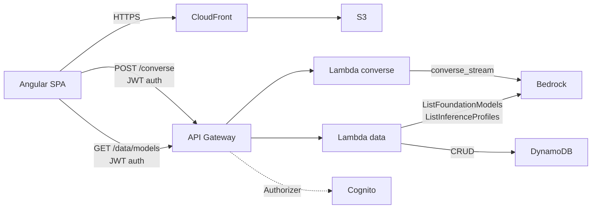

# Cert Study Assistant

AI-powered study app for IT certification exams (AWS, Anthropic CCAF, and others). Paste exam questions, receive structured reviews via Amazon Bedrock (Nova models) with streaming, accumulate reviews across sessions, and export as Markdown.

**Live:** [https://cert.serverlessai.click](https://cert.serverlessai.click)

## Features

- **Question Reviews** — paste a multiple-choice question, get a structured Markdown review (concepts, correct answer reasoning, incorrect alternatives analysis)
- **Transcript Summaries** — paste lesson transcripts, get a layered technical summary
- **Streaming** — responses arrive token-by-token via NDJSON
- **Pack System** — organize study by certification exam (domains, colors, version tracking)
- **Export** — download Markdown files grouped by domain
- **Auth** — Cognito email/password login (no API keys needed)

## Architecture



## Project Structure

```
├── backend/
│   ├── infrastructure/       # Terraform module
│   │   ├── aws_*.tf          # Resources by service
│   │   ├── lambda/converse/  # Lambda source (Flask + Bedrock)
│   │   ├── scripts/          # deploy_frontend.sh
│   │   └── templates/        # Cognito email templates
│   └── environments/
│       └── production/       # Env config (tfvars, backend.hcl)
├── frontend/                 # Angular 21 SPA
│   ├── src/app/
│   │   ├── core/services/    # bedrock.service, auth.service, etc.
│   │   └── features/         # login, question-input, review-viewer, etc.
│   └── public/examples/      # Pack JSONs served by the app
├── docs/                     # Documentation + pack examples
│   ├── README.md             # Architecture diagrams (Mermaid)
│   └── examples/             # One JSON per certification
└── README.md                 # This file
```

## Quick Start

```bash
# 1. Configure backend
cd backend/environments/production
cp backend.hcl.example backend.hcl
cp terraform.tfvars.example terraform.tfvars
# Edit both files with your values

# 2. Deploy everything (infra + frontend)
terraform init -backend-config=backend.hcl
terraform apply

# 3. Access the app at your configured domain
```

## Available Models

The model list is **loaded dynamically** from Bedrock at login (`GET /data/models`). The app discovers all text-in/text-out models with streaming support that are active and invocable in your account. Models requiring inference profiles (e.g., Nova 2) are resolved automatically.

Static fallback (if the API call fails):

| Model | Tier | Best For |
|-------|------|----------|
| Nova Micro | Fast | Quick reviews, low cost |
| Nova Lite | Balanced | Default, good quality/speed tradeoff |
| Nova Pro | Deep | Complex questions, best quality |

### Reasoning (Extended Thinking)

Models that support reasoning are marked with **(reasoning)** in the model selector. When a reasoning-capable model is selected, the backend automatically enables extended thinking (`reasoningConfig` with effort `low`), which makes the model internally plan its response step-by-step before generating output. This improves accuracy for structured tasks (like maintaining correct option ordering in reviews).

**Current limitations:**
- Reasoning is currently enabled only for **Amazon Nova 2** models (pattern `nova-2` in the model ID). The `reasoningConfig` parameter is Amazon-specific.
- Other providers (Anthropic Claude, DeepSeek) have their own thinking/reasoning mechanisms with different API parameters. These are **not** automatically enabled — extending support would require provider-specific logic.
- During the reasoning phase, the user sees a brief pause before text starts streaming (the model is "thinking" internally). This is expected behavior, not an error.
- Reasoning tokens are **charged** even though the reasoning content appears as `[REDACTED]` in the API response.

## Pack Examples

Pre-built study packs for all current AWS certifications are in [`docs/examples/`](docs/examples/). Import them in the app via Pack Editor → Import file.

## Tech Stack

- **Frontend**: Angular 21, standalone components, Signals, Angular Material (dialogs/spinners), SCSS
- **Backend**: Terraform (AWS provider ~> 6.0), Python 3.13 (Flask + Gunicorn)
- **Cloud**: S3, CloudFront, Route53, ACM, Cognito, API Gateway, Lambda, DynamoDB, Bedrock
- **AI**: Any text/streaming model in Bedrock (dynamically discovered); Amazon Nova (Micro/Lite/Pro, Nova 2 Lite) via `converse_stream` API

## Author

**Carlos Biagolini-Jr.**
- [LinkedIn](https://www.linkedin.com/in/biagolini/)
- [Medium](https://medium.com/@biagolini)
