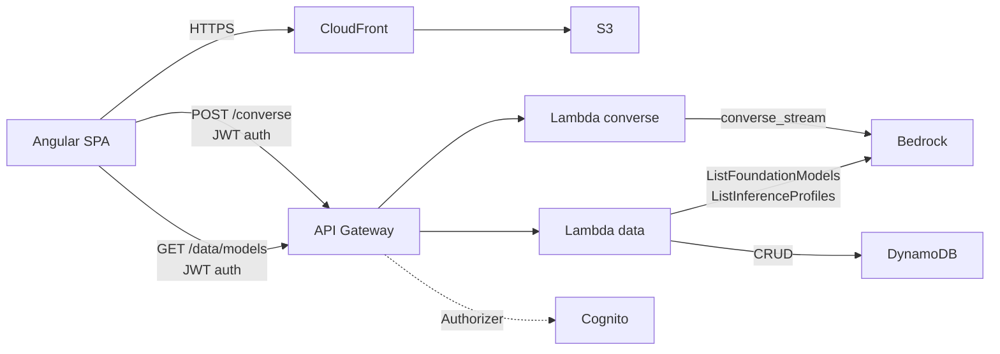

# Cert Study Assistant

AI-powered study app for IT certification exams (AWS, Anthropic CCAF, and others). Paste exam questions, receive structured reviews via Amazon Bedrock (Nova models) with streaming, accumulate reviews across sessions, and export as Markdown.

**Live:** deployed on a custom domain (e.g. `cert.yourdomain.com`) — set via `domain_name` / `hosted_zone_name` in `terraform.tfvars`.

## Features

The app is organized around the certification: **Certification → Question banks → Questions**, with everything else (mock exams, notes, transcripts, chat, performance) inside that certification's workspace.

- **Home** — your certifications with question/bank/note/attempt counts, a catalog of suggested certifications filtered by ecosystem (AWS, Azure, Google Cloud, Kubernetes, Terraform, Linux, MongoDB, Anthropic, others) and ranked by your profile, an add/edit certification editor prefilled from the catalog, and a one-click starter kit with sample data
- **Question banks** — one bank per practice exam of the certification, identified by author/vendor and version (plus source link and notes), grouped by author, with a per-domain breakdown that doubles as a filter and a unified "all questions" view
- **Question reviews** — paste a multiple-choice question, get a structured review (concepts, correct answer reasoning, incorrect alternatives analysis), or paste a ready-made one
- **Bulk import** — upload an exam file into a bank; AI extracts every question for human review (see below)
- **Mock exams** — draw from selected banks and domains, instant feedback or strict final review, exam clock and per-question budget with overtime, item navigator with filters and status badges, pause and resume up to five sessions, early finish with a blank/answered summary, pass/fail verdict against the certification's pass mark, per-domain results, an AI tutor per question
- **Performance** — attempt history with filters, score evolution chart, domain mastery and weak-domain suggestions
- **Notes** — Markdown notes stored privately in S3, with a toolbar, preview, image upload and an AI copilot that reads the note (polish, exam summary, flashcards, practice questions)
- **Transcript summaries and tutor chat** — scoped to the certification, savable as notes
- **Student profile** — identity, ecosystems of interest, per-certification status (want to do, studying, earned) and accommodation default
- **Settings** — languages, theme, models, workspace tabs, quiz toolbar, password change, full JSON backup, AI costs and budget
- **Streaming** — responses arrive token-by-token via NDJSON
- **Multilingual** — English, Portuguese, Spanish and Italian
- **Auth** — Cognito email/password login (no API keys needed)

## Adding Questions

Three ways to get a question into a bank (Question banks tab, "Add question" or "Import with AI"):

- **Generate with AI** — paste one exam question, AI produces a structured review (concepts, correct answer reasoning, incorrect alternatives analysis).
- **Add ready-made** — paste an already-written Markdown review (e.g. copied from Claude App) and save it directly, no AI call.
- **Import exam file** — upload a whole exam file (PDF, Markdown, HTML, or a ZIP bundling one of those with an image folder) and AI extracts every question in it automatically via Bedrock (Converse API, vision + forced tool-use). Runs as an async Step Functions job so a large file (dozens of questions) doesn't block the UI; check progress from the header pill. If your source export doesn't match any supported format, see [docs/question-markdown-format.md](docs/question-markdown-format.md) for the target Markdown shape and a copy-paste AI-assistant prompt that converts a one-off/rare format to it.

**Known limitation — images in imported exams:** the extraction model frequently fails to reference an image even when one exists and is clearly relevant to the question (a model instruction-following gap, not a bug — confirmed by inspecting the exact source chunk and image bytes sent to it). If a question comes in missing an image it should have, add it by hand: open the question in edit mode (or the "Add ready-made" screen), use "Attach an image" to upload it, then paste the generated `` snippet into the stem, an alternative, or a comment.

## Architecture


```mermaid
graph LR
    A[Angular SPA] -->|HTTPS| B[CloudFront]
    B --> C[S3]
    A -->|POST /converse<br/>JWT auth| D[API Gateway]
    A -->|GET /data/models<br/>JWT auth| D
    D --> E[Lambda converse]
    D --> F[Lambda data]
    E -->|converse_stream| G[Bedrock]
    F -->|ListFoundationModels<br/>ListInferenceProfiles| G
    F -->|CRUD| H[DynamoDB]
    D -.->|Authorizer| I[Cognito]
```

## Project Structure

```
├── backend/
│   ├── infrastructure/       # Terraform module
│   │   ├── aws_*.tf          # Resources by service
│   │   ├── lambda/converse/  # Lambda source (Flask + Bedrock)
│   │   ├── scripts/          # deploy_frontend.sh
│   │   └── templates/        # Cognito email templates
│   └── environments/
│       └── production/       # Env config (tfvars, backend.hcl)
├── frontend/                 # Angular 21 SPA
│   ├── src/app/
│   │   ├── core/services/    # bedrock.service, auth.service, etc.
│   │   └── features/         # login, question-input, review-viewer, etc.
│   ├── public/examples/      # Certification templates + index.json (catalog)
│   └── scripts/              # build_catalog_index.py, check-i18n-keys.mjs
├── docs/                     # Documentation
│   ├── architecture.md       # System architecture + diagrams
│   ├── backend.md            # Backend (Terraform, Lambdas, API, DynamoDB)
│   └── frontend.md           # Frontend (Angular, services, prompts, export)
└── README.md                 # This file
```

## Prerequisites

A single `terraform apply` deploys the whole stack, but that one command orchestrates a container image build, a Python/boto3 bridge for Bedrock AgentCore, and a full Angular build. All of the tooling below must be present and working on the machine that runs the apply, otherwise the apply fails partway through. See [backend/README.md](backend/README.md) for the exact resource each tool backs and for troubleshooting.

| Requirement | Why it is needed | Check |
|-------------|------------------|-------|
| **Terraform** >= 1.0 | Runs the deploy. The S3 backend uses a lockfile, so no DynamoDB lock table is required. | `terraform version` |
| **AWS CLI v2**, configured | Named profile used by Terraform, by the frontend S3 sync, and by the AgentCore scripts. The profile name must match `aws_profile` in your tfvars and `profile` in `backend.hcl`. | `aws sts get-caller-identity --profile <your-profile>` |
| **Docker**, daemon running, with **buildx** | `terraform apply` builds the review agent container image for `linux/arm64` and pushes it to ECR (`null_resource.review_agent_image_build`). The daemon must be up before you apply. | `docker info` and `docker buildx version` |
| **Python 3** with **boto3** | Terraform shells out to `scripts/agentcore_deploy.py` through an `external` data source to create the Bedrock AgentCore Gateway and Runtime (no native Terraform resource exists for them yet). | `python3 -c "import boto3; print(boto3.__version__)"` |
| **Node.js** (LTS) and **npm** | The frontend build runs inside the apply (`scripts/deploy_frontend.sh` runs `npm install` then `ng build`), so Node must be installed on the deploy machine, not only for local dev. | `node -v` and `npm -v` |

AWS account prerequisites, which Terraform does not create for you:

- **A Route 53 public hosted zone** for your domain must already exist. Set its name in `hosted_zone_name`. Terraform adds the ACM DNS-validation records and the CloudFront alias record into this zone, but it does not create the zone or register the domain.
- **Bedrock model access** must be enabled in your account and region for the models you use. The defaults are Amazon Nova (`amazon.nova-lite-v1:0`, `us.amazon.nova-pro-v1:0`, `us.amazon.nova-2-lite-v1:0`). Enable them under Bedrock → Model access in the console before deploying.
- **An S3 bucket for Terraform state** must already exist (referenced in `backend.hcl`).

To install Node locally, grab the LTS release from [nodejs.org](https://nodejs.org/) or use a version manager such as `nvm`.

## Quick Start

```bash
# 1. Make sure Docker is running (the apply builds and pushes a container image)
docker info >/dev/null && echo "Docker OK"

# 2. Configure the backend and variables
cd backend/environments/production
cp backend.hcl.example backend.hcl
cp terraform.tfvars.example terraform.tfvars
# Edit both files with your values (see the Prerequisites table and
# backend/README.md for what each value means)

# 3. Initialize Terraform against your S3 backend
terraform init -backend-config=backend.hcl

# 4. Deploy everything (infra + agent image + AgentCore + frontend) in one step
terraform apply

# 5. Access the app at the custom domain you set in terraform.tfvars
#    (terraform prints custom_domain_url when the apply finishes)
```

The first apply typically takes several minutes, mostly waiting on CloudFront to deploy and on the ACM certificate's DNS validation. If anything fails partway through, read the error and check the Troubleshooting section in [backend/README.md](backend/README.md); the common cases (Docker not running, state lock left behind, the AgentCore log group already existing after a destroy and recreate) each have a one-line fix there. Re-running `terraform apply` after fixing the cause resumes from where it stopped.

## Local Frontend Development

To run the Angular SPA locally you need Node.js (which ships with `npm`). Install the LTS release from [nodejs.org](https://nodejs.org/) or via a version manager such as `nvm`. Confirm it is available with `node -v` and `npm -v`.

Install the frontend dependencies and start the dev server:

```bash
cd frontend
npm install
npm start
```

Open `http://localhost:4200/`. The dev server reloads on save.

`npm start` runs `ng serve` (the same as `ng s`). If you have the Angular CLI installed globally you can call `ng serve` or `ng s` directly instead.

Other useful scripts (run from `frontend/`):

```bash
npm run build    # production build
npm test         # unit tests
```

## Available Models

The model list is **loaded dynamically** from Bedrock at login (`GET /data/models`). The app discovers all text-in/text-out models with streaming support that are active and invocable in your account. Models requiring inference profiles (e.g., Nova 2) are resolved automatically.

Static fallback (if the API call fails):

| Model | Tier | Best For |
|-------|------|----------|
| Nova Micro | Fast | Quick reviews, low cost |
| Nova Lite | Balanced | Default, good quality/speed tradeoff |
| Nova Pro | Deep | Complex questions, best quality |

### Reasoning (Extended Thinking)

Models that support reasoning are marked with **(reasoning)** in the model selector. When a reasoning-capable model is selected, the backend automatically enables extended thinking (`reasoningConfig` with effort `low`), which makes the model internally plan its response step-by-step before generating output. This improves accuracy for structured tasks (like maintaining correct option ordering in reviews).

**Current limitations:**
- Reasoning is currently enabled only for **Amazon Nova 2** models (pattern `nova-2` in the model ID). The `reasoningConfig` parameter is Amazon-specific.
- Other providers (Anthropic Claude, DeepSeek) have their own thinking/reasoning mechanisms with different API parameters. These are **not** automatically enabled — extending support would require provider-specific logic.
- During the reasoning phase, the user sees a brief pause before text starts streaming (the model is "thinking" internally). This is expected behavior, not an error.
- Reasoning tokens are **charged** even though the reasoning content appears as `[REDACTED]` in the API response.

## Certification Catalog

Certification templates (AWS, Anthropic, HashiCorp, MongoDB, Kubernetes, Google Cloud, Azure, CompTIA, LPI) are in [`frontend/public/examples/`](frontend/public/examples/). Home reads `index.json`, which `frontend/scripts/build_catalog_index.py` builds from the templates plus the catalog metadata kept in that script (code, ecosystem, level, duration, question count, pass mark, official link). Run it after adding or editing a template.

## Tech Stack

- **Frontend**: Angular 21, standalone components, Signals, Angular Material (dialogs/spinners), SCSS
- **Backend**: Terraform (AWS provider ~> 6.0), Python 3.13 (Flask + Gunicorn)
- **Cloud**: S3, CloudFront, Route53, ACM, Cognito, API Gateway, Lambda, DynamoDB, Bedrock
- **AI**: Any text/streaming model in Bedrock (dynamically discovered); Amazon Nova (Micro/Lite/Pro, Nova 2 Lite) via `converse_stream` API

## Author

**Carlos Biagolini-Jr.**
- [LinkedIn](https://www.linkedin.com/in/biagolini/)
- [Medium](https://medium.com/@biagolini)
