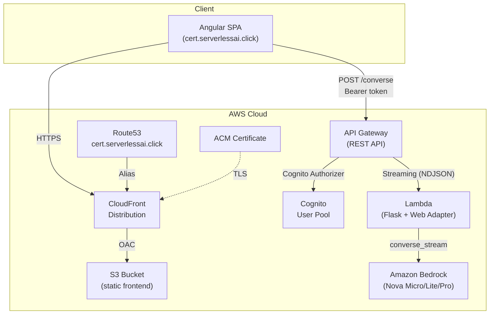
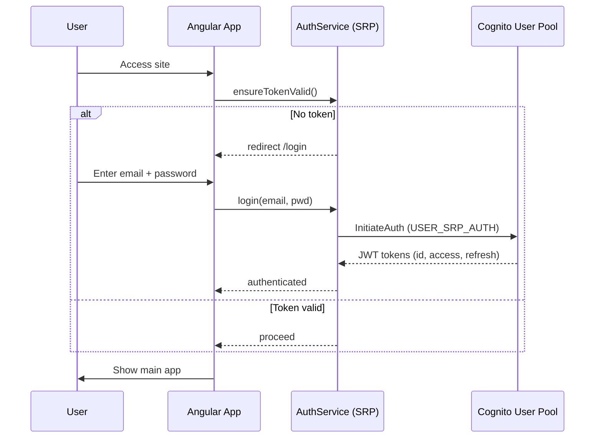
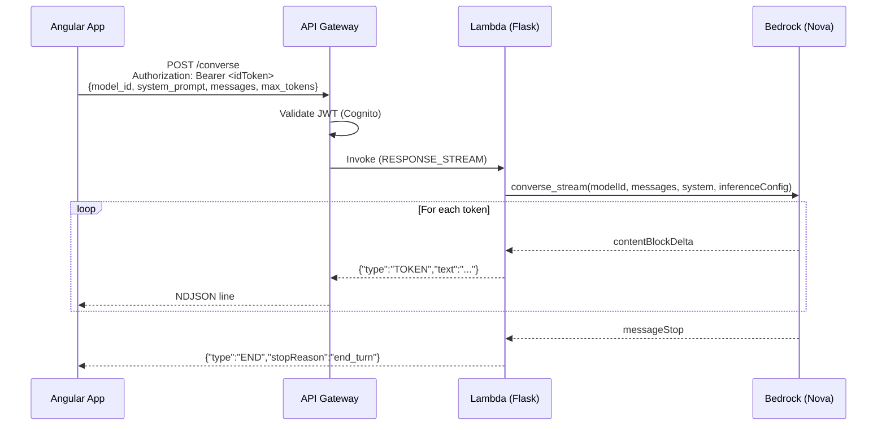

# Cert Study Assistant — Technical Documentation

AI-powered certification exam preparation using Amazon Bedrock (Nova models) with streaming responses.

## Architecture



## Authentication Flow



## Request Flow (Streaming)



## Components

| Component | Service | Purpose |
|-----------|---------|---------|
| Frontend | S3 + CloudFront | Angular SPA with Cognito SRP auth |
| Auth | Cognito User Pool | Email/password login, JWT tokens |
| API | API Gateway (REST) | `POST /converse` with Cognito authorizer, streaming |
| Compute | Lambda + Web Adapter | Flask app, Bedrock converse_stream via NDJSON |
| AI | Amazon Bedrock | Nova Micro/Lite/Pro models |
| DNS | Route53 + ACM | Custom domain with TLS |

## Deploy

### Prerequisites
- AWS CLI configured with profile
- Terraform >= 1.7
- Node.js + npm
- Amazon Nova models enabled in Bedrock (us-east-1)

### Steps

```bash
cd backend/environments/production
cp backend.hcl.example backend.hcl          # fill values
cp terraform.tfvars.example terraform.tfvars # fill values
terraform init -backend-config=backend.hcl
terraform apply
```

`frontend_deploy_enabled = true` automatically: generates `environment.ts` → builds Angular → syncs to S3 → invalidates CloudFront.

## Pack Examples

Pre-configured study packs in [`docs/examples/`](examples/):

| File | Certification |
|------|---------------|
| `aws-clf-c02-pack.json` | AWS Cloud Practitioner |
| `aws-aif-c01-pack.json` | AWS AI Practitioner |
| `aws-saa-c03-pack.json` | AWS Solutions Architect Associate |
| `aws-dva-c02-pack.json` | AWS Developer Associate |
| `aws-soa-c03-pack.json` | AWS CloudOps Engineer Associate |
| `aws-dea-c01-pack.json` | AWS Data Engineer Associate |
| `aws-mla-c01-pack.json` | AWS ML Engineer Associate |
| `aws-sap-c02-pack.json` | AWS Solutions Architect Professional |
| `aws-dop-c02-pack.json` | AWS DevOps Engineer Professional |
| `aws-scs-c03-pack.json` | AWS Security Specialty |
| `aws-ans-c01-pack.json` | AWS Advanced Networking Specialty |
| `aws-aip-c01-pack.json` | AWS Generative AI Developer Professional |
| `ccaf-pack.json` | Claude Certified Architect Foundations |

Import via Pack Editor → "Import file" in the app.
