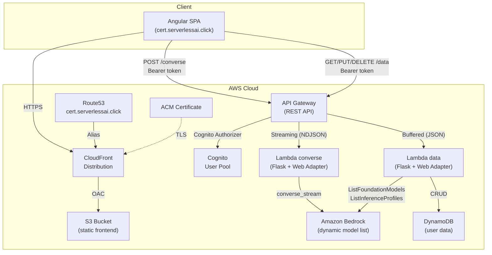
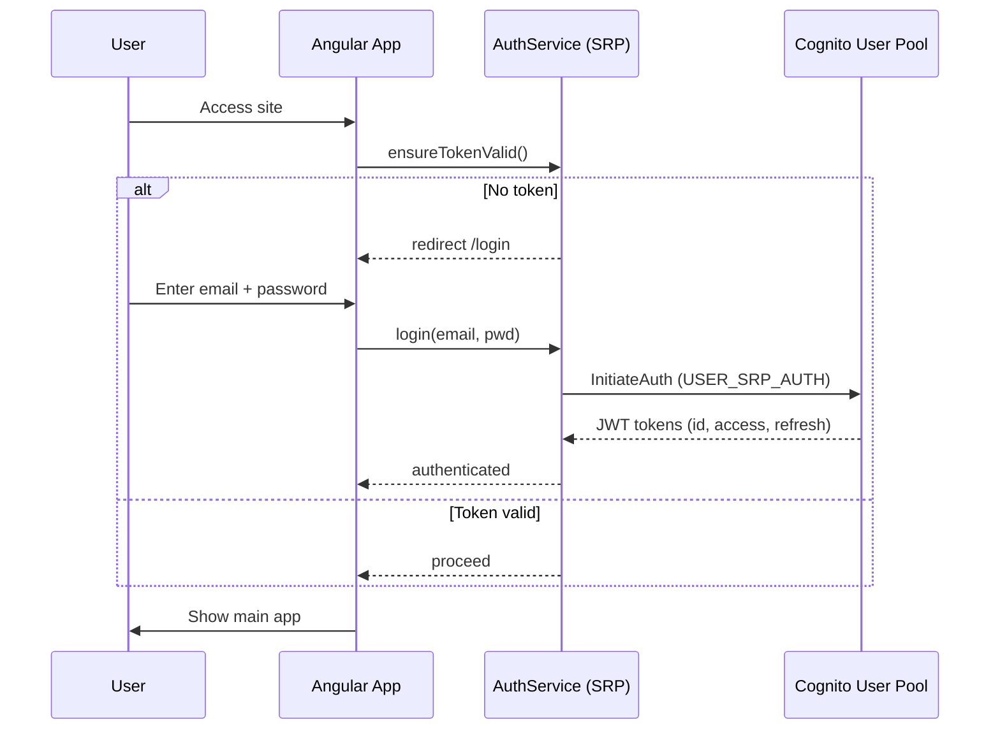
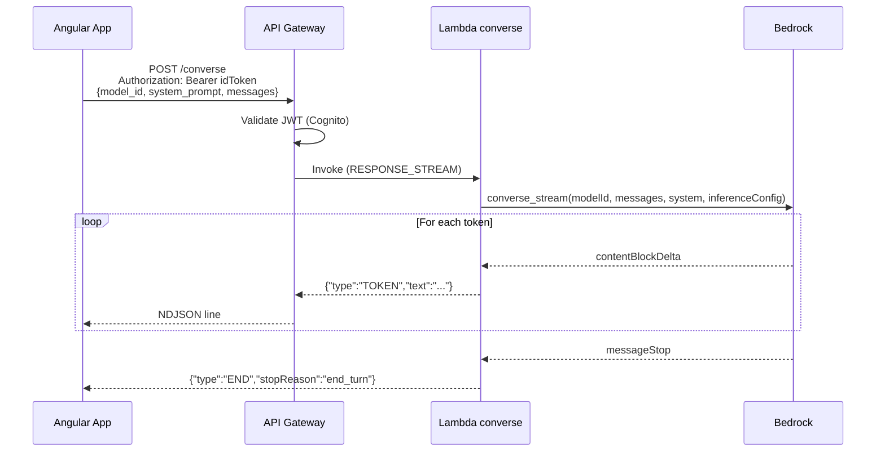

# Architecture

AI-powered certification exam preparation using Amazon Bedrock with streaming responses.

## Overview



## Components

| Component | Service | Purpose |
|-----------|---------|---------|
| Frontend | S3 + CloudFront | Angular 21 SPA with Cognito SRP auth |
| Auth | Cognito User Pool | Email/password login, JWT tokens |
| API | API Gateway (REST) | Routes with Cognito authorizer, streaming support |
| Converse | Lambda + Web Adapter | Flask app, Bedrock `converse_stream` via NDJSON |
| Data | Lambda + Web Adapter | CRUD for packs/questions/scripts, model discovery |
| Storage | DynamoDB | Single-table design for user data |
| AI | Amazon Bedrock | Dynamic model list (Nova, Claude, etc.) |
| DNS | Route53 + ACM | Custom domain with TLS |

## Authentication Flow



## Streaming Request Flow



## Deploy

### Prerequisites

- AWS CLI configured with profile
- Terraform >= 1.7
- Node.js + npm
- Amazon Nova models enabled in Bedrock (us-east-1)

### Steps

```bash
cd backend/environments/production
cp backend.hcl.example backend.hcl          # fill values
cp terraform.tfvars.example terraform.tfvars # fill values
terraform init -backend-config=backend.hcl
terraform apply
```

Setting `frontend_deploy_enabled = true` automatically: generates `environment.ts` → builds Angular → syncs to S3 → invalidates CloudFront.

## Related docs

- [Backend documentation](./backend.md)
- [Frontend documentation](./frontend.md)
