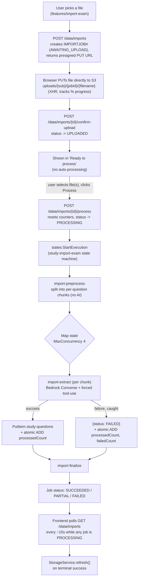

# Bulk exam import pipeline

How a whole practice exam file (PDF, Markdown, or a ZIP of Markdown + an
`img/` folder) becomes many structured `Question` records (see
[DynamoDB schema](./dynamodb-schema.md)) without the user adding them one at
a time. Unlike the single-question [ingestion pipeline](./question-ingestion.md)
— which is deterministic parsing plus one small AI enrichment call — this
pipeline asks a vision-capable model to do the whole structural extraction
per question, because the source material is too messy and visually-coded
(see "Why vision, not a parser" below) for a fixed rule to handle reliably.

## Why an async pipeline

A single exam file can contain 75+ questions spread over hundreds of pages.
Extracting all of them means one Bedrock call per question, which can take
minutes in total — too slow for a synchronous HTTP request, and too much
work to safely fit inside one Lambda's 15-minute ceiling as files grow. The
pipeline is a **Step Functions Standard workflow** (`study-import-exam`)
with a **Map state** fanning out one Bedrock call per question chunk, with
retries and per-item failure isolation built in.

## Upload and processing are two separate, explicit steps

A "simulado" can be more than one file (e.g. several PDFs), so uploading
and processing are deliberately decoupled: uploading a file only gets it
onto S3 and marks it ready — nothing is queued for extraction until the
user explicitly picks which uploaded file(s) to process. This also means a
page reload never has to guess whether a half-finished upload is still
"active" — an early version of this feature auto-resumed polling for any
non-terminal job on load, which meant a job that never got its upload
confirmed (e.g. a network drop) stayed stuck forever and kept reappearing
as if it were in progress.

1. **Create + upload.** Frontend calls `POST /data/imports` with
   `{packId, filename}`. The backend (`lambda/data/app.py`) validates the
   pack belongs to the caller, creates an `IMPORTJOB#{jobId}` record
   (`status: AWAITING_UPLOAD`) in the general `study-data` table, and
   returns a presigned S3 PUT URL for `uploads/{sub}/{jobId}/{filename}` in
   the private `study-assets-<account_id>` bucket. The frontend `PUT`s the
   raw file straight to S3 via `XMLHttpRequest` (tracking real upload
   progress), bypassing API Gateway's ~10MB payload limit entirely — large
   PDFs wouldn't fit through it.
2. **Confirm.** Once the PUT resolves, the frontend calls
   `POST /data/imports/{id}/confirm-upload`, which flips the job to
   `status: UPLOADED`. The file now shows up in the "Ready to process" list
   — nothing else happens automatically.
3. **Process.** The user selects one or more `UPLOADED` files and clicks
   "Process selected". The frontend calls `POST /data/imports/{id}/process`
   once per selected job. That handler resets the job's counters, sets
   `status: PROCESSING`, and calls `states:StartExecution` on
   `study-import-exam` directly — with an input shaped exactly like the S3
   event `import-preprocess` originally expected
   (`{"detail": {"bucket": {"name": ...}, "object": {"key": ...}}}`), so
   that Lambda needed no changes when the trigger moved from an automatic
   S3 event to an explicit API call. Retrying a previously `FAILED`/
   `PARTIAL` job reuses this same endpoint.

## The three Step Functions tasks

### 1. `import-preprocess` — chunk the file (no AI)

Reads the uploaded file and splits it into one **chunk per question**,
using dumb boundary detection only:

- **ZIP** — extracts the bundled `.md` + `img/` folder, uploads each image
  to `scratch/{jobId}/raw/img/{basename}`, and splits the Markdown on
  numbered headings (`#### 1. Question`, tolerating the ground truth's
  3x-repeated headings per question).
- **Markdown** (no ZIP) — same splitter, no images (a bare `.md` upload has
  nowhere to source external image files from).
- **PDF** — opens with PyMuPDF, searches each page's text for
  `Pergunta N` / `Question N`, and rasterizes every page in that question's
  range to `scratch/{jobId}/pages/{pageNum}.png` at 150 DPI.

Chunking deliberately does **not** try to exclude unrelated content (e.g. a
full page of an unrelated linked article interleaved between two
questions in a browser-printed PDF export) — that's left to the extraction
model in step 2, since telling "this is the question" from "this is
supplementary reference content" often requires actually reading it.

Sets the job's `status` to `PROCESSING` and `totalQuestions` to the chunk
count.

### 2. `import-extract` — one Bedrock call per chunk (the Map state)

For each chunk, one **non-streaming** `bedrock-runtime.converse()` call with
a **forced tool call** (`toolChoice: {tool: {name: "emit_question"}}`) —
the model has no choice but to return a `Question`-shaped JSON object
directly. This skips the "generate Markdown, then regex-parse it" round
trip the single-question flow uses; that round trip only exists there to
support the interactive live-preview streaming UI, which a batch job has no
need for.

**Why vision, not a parser.** The two real source formats both hide the
signal a deterministic parser would need:

- A browser-printed PDF marks the correct option only with a **colored
  border** around its box — a layout/visual cue, not extractable from text.
- Both formats include **irrelevant status labels** (`Incorreto`, `Correto`,
  `Ignorado` — what some earlier test-taker answered) sitting right next to
  the real content, which a naive parser could easily mistake for the
  answer key.

The system prompt (`lambda/import_extract/prompt.py`) explicitly tells the
model to ignore those status labels and interleaved unrelated content, and
to identify the true answer only from explicit "correct answer" prose or
the bordered/labeled box.

**Images**: the model may reference an image inline with a `{{IMG:n}}`
placeholder (PDF path, n = index of a supplied page image) or by preserving
the source's own `` Markdown (ZIP/MD path). After the call, the
Lambda rewrites these to `` and
copies **only the images actually referenced in the surviving output**
from `scratch/` to their permanent `images/{sub}/{jobId}/{questionId}/`
key — nothing is promoted just because it was sent to the model.

Any failure (model refusal, malformed output, validation failure) is caught
internally and returned as `{"status": "FAILED"}` rather than thrown, so
one bad question never fails the other 74. `processedCount`/`failedCount`
are incremented via a genuinely atomic DynamoDB `UpdateItem ADD` on native
top-level attributes (not inside the JSON `data` blob most other item types
use) — this is what lets several Map iterations update the same job record
concurrently without racing.

### 3. `import-finalize` — aggregate into a final status

Counts `SUCCEEDED` vs `FAILED` results and sets the job's final `status`:
`SUCCEEDED` (no failures), `PARTIAL` (some failures), or `FAILED` (all
failures, or preprocessing itself failed).

## Idempotency

`questionId` is always `{jobId}-{chunkIndex}` — deterministic, never
random. Any retry — a single Map iteration, or even a whole duplicate
execution from EventBridge's at-least-once delivery — overwrites the same
`study-questions` item and the same `images/...` S3 keys rather than
creating duplicates.

## Frontend

`core/services/import-exam.service.ts` owns one `jobs` signal (the user's
full job list, refreshed via `GET /data/imports`) that both
`features/import-exam/import-exam.component.ts` (grouped into "Ready to
process" / "Processing" / "Recent") and the header
`ImportStatusPillComponent` read from — no per-component polling. The
service centrally polls every ~15s **only while at least one job is
`PROCESSING`**, stopping automatically once none are, and calls
`StorageService.refresh()` when a job just reached `SUCCEEDED`/`PARTIAL` —
new questions were written directly by backend Lambdas, bypassing this
app's own debounced push path entirely, so a pull is the only way they
appear in `QuestionsService`.

## Flow diagram

## Related docs

- [DynamoDB schema](./dynamodb-schema.md) — the `IMPORTJOB#` and `Question`
  (`starred` field) shapes
- [Question ingestion pipeline](./question-ingestion.md) — the single-question
  flow this one deliberately does NOT reuse for extraction, and why
- [Backend documentation](./backend.md)
