# Bulk exam import pipeline

How a whole practice exam file (PDF, Markdown, HTML, or a ZIP bundling Markdown/HTML with an image folder) becomes many structured `Question` records (see [DynamoDB schema](./dynamodb-schema.md)) without the user adding them one at a time. Unlike the single-question [ingestion pipeline](./question-ingestion.md) — which is deterministic parsing plus one small AI enrichment call — this pipeline asks a vision-capable model to do the whole structural extraction per question, because the source material is too messy and visually-coded (see "Why vision, not a parser" below) for a fixed rule to handle reliably.

## Why two phases, with a human review step between them

The pipeline used to do structure extraction and AI explanation generation back-to-back in one Bedrock+AgentCore round trip per question, writing a final `Question` straight to the database. That meant an extraction error (a misread correct answer, a truncated multi-paragraph stem) was only discoverable *after* the more expensive explanation step had already run on the bad data, and after the question was already sitting in the real question list — with no way to fix just that one question without re-running the whole import. The pipeline now splits into two independently-triggerable phases with a review screen in between:

- **Phase 1 — structure extraction** (`import-preprocess` → `import-extract`, Step Functions `study-import-exam`): reads the source file, chunks it, and extracts stem/alternatives/domain per question — no explanation yet. Writes one **draft** row per chunk (see [DynamoDB schema](./dynamodb-schema.md)'s `import-drafts` table) instead of a final `Question`.
- **Review** (`features/import-review`): the user sees every extracted draft, ticks the ones that look right, re-extracts (optionally with a correction hint) the ones that don't, then submits some or all of them.
- **Phase 2 — explanation generation** (`import-explain`, Step Functions `study-import-exam-explain`): reads each approved draft, calls the AgentCore review agent, writes the final `Question`, and flips the draft's `promoted` flag.

Both phases keep the same Map-based, per-item-fault-isolated shape the original single-phase pipeline had — this is a seam inserted into an existing design, not a rebuild.

## Why an async pipeline

A single exam file can contain 75+ questions spread over hundreds of pages. Extracting or explaining all of them means one Bedrock/AgentCore call per question, which can take minutes in total — too slow for a synchronous HTTP request, and too much work to safely fit inside one Lambda's execution ceiling as files grow. Each phase is its own **Step Functions Standard workflow** with a **Map state** fanning out one call per item, with retries and per-item failure isolation built in.

## Upload, processing, review, and generation are separate, explicit steps

A "simulado" can be more than one file (e.g. several PDFs), so every step is deliberately decoupled: uploading a file only gets it onto S3 and marks it ready; processing it only extracts structure; nothing is sent for explanation until the user reviews and submits it. This also means a page reload never has to guess whether a half-finished step is still "active" — an early version of this feature auto-resumed polling for any non-terminal job on load, which meant a job that never got its upload confirmed (e.g. a network drop) stayed stuck forever and kept reappearing as if it were in progress.

1. **Create + upload.** Frontend calls `POST /data/imports` with `{packId, filename, expectedQuestions?}`. The backend (`lambda/data/app.py`) validates the pack belongs to the caller, creates an `IMPORTJOB#{jobId}` record (`status: AWAITING_UPLOAD`) in the general `study-data` table, and returns a presigned S3 PUT URL for `uploads/{sub}/{jobId}/{filename}` in the private `study-assets-<account_id>` bucket. `expectedQuestions` is an optional soft hint — never validated, just shown back as a mismatch warning on the review screen. The frontend `PUT`s the raw file straight to S3 via `XMLHttpRequest` (tracking real upload progress), bypassing API Gateway's ~10MB payload limit entirely — large PDFs wouldn't fit through it.
2. **Confirm.** Once the PUT resolves, the frontend calls `POST /data/imports/{id}/confirm-upload`, which flips the job to `status: UPLOADED`. The file now shows up in the "Ready to process" list — nothing else happens automatically.
3. **Process (Phase 1).** The user selects one or more `UPLOADED` files and clicks "Process selected". The frontend calls `POST /data/imports/{id}/process` once per selected job. That handler resets the job's counters, sets `status: EXTRACTING`, and calls `states:StartExecution` on `study-import-exam` directly — with an input shaped exactly like the S3 event `import-preprocess` originally expected (`{"detail": {"bucket": {"name": ...}, "object": {"key": ...}}}`), so that Lambda needed no changes when the trigger moved from an automatic S3 event to an explicit API call. Retrying a previously `FAILED` job (one that never produced any drafts) reuses this same endpoint.
4. **Review.** Once Phase 1 finishes, the job lands on `status: AWAITING_REVIEW` and a "Review N questions" link takes the user to `features/import-review` (`/questions/:packId/import/:jobId`). Each draft shows its extracted stem/alternatives/domain with a checkbox; a per-row re-extract button re-runs Phase 1's extraction Lambda directly for just that one chunk, optionally with a typed correction hint.
5. **Generate explanations (Phase 2).** The user clicks "Process selected (N)" (just the checked drafts) or "Process all (M)" (every successfully-extracted, not-yet-explained draft). The frontend calls `POST /data/imports/{id}/generate-explanations` with the chosen draft indices (or none, meaning "all"). That handler resets the job's counters, sets `status: GENERATING`, `explainTotal`, and starts `study-import-exam-explain`.

## Phase 1 — structure extraction

### 1. `import-preprocess` — chunk the file (no AI)

Reads the uploaded file and splits it into one **chunk per question**, using dumb boundary detection only:

- **ZIP** — extracts the bundled `.md` or `.html`/`.htm` file plus any image files anywhere in the archive, uploads each image to `scratch/{jobId}/raw/img/{basename}`, and splits on numbered Markdown headings (`#### 1. Question`, tolerating the ground truth's 3x-repeated headings per question) or, for HTML, on each `Pergunta N` / `Question N` anchor (the same per-question status header a browser-saved quiz-results page renders — the same "Pergunta N"/"Question N" convention the PDF path already relies on). The HTML branch strips `<script>`/`<style>` first, converts `` tags to the same `` syntax the Markdown path uses, and inserts line breaks at block-tag boundaries (`
`, `
`, `</li>`, ` `) so adjacent alternatives don't run together into one wall of text — both paths converge on the same `kind: "markdown"` chunk shape, so `import-extract` doesn't need to know which source format produced it.
- **Markdown** (no ZIP) — same splitter, no images (a bare `.md` upload has nowhere to source external image files from).
- **PDF** — opens with PyMuPDF, searches each page's text for `Pergunta N` / `Question N`, and rasterizes every page in that question's range to `scratch/{jobId}/pages/{pageNum}.png` at 150 DPI.

Chunking deliberately does **not** try to exclude unrelated content (e.g. a full page of an unrelated linked article interleaved between two questions in a browser-printed PDF export) — that's left to the extraction model in step 2, since telling "this is the question" from "this is supplementary reference content" often requires actually reading it.

Sets the job's `status` to `EXTRACTING` and `totalQuestions` to the chunk count.

### 2. `import-extract` — one Bedrock call per chunk (the Map state)

For each chunk, one **non-streaming** `bedrock-runtime.converse()` call with a **forced tool call** (`toolChoice: {tool: {name: "emit_question"}}`) — the model has no choice but to return a structure-only JSON object directly (stem, alternatives, domain, title — no explanation content). This Lambda is invoked two ways: once per chunk from the Phase 1 Map, and directly (single-shot, `RequestResponse`) by `lambda/data/app.py`'s per-question re-extract route — the same code path handles both, since it's already a complete, self-contained single-chunk unit of work.

**Re-extraction with a hint.** The review screen's re-extract action can carry an optional `hint` string — a human correction ("the correct answer is C, not B", "the stem continues after the diagram reference"). It's appended to the prompt as an authoritative correction and threads straight through to the same extraction call; the resulting draft overwrites the same `DRAFT#{jobId}#{index}` row (same id convention as the original pipeline's idempotent retries), never creates a duplicate.

**Model selection.** The model is a per-request choice, not hardcoded: the frontend Settings screen has a dedicated **"Exam import model"** picker (`AppSettings.importExtractionModel`, default `us.amazon.nova-pro-v1:0` — distinct from "Default model", which only affects the interactive Generate-with-AI flow). The chosen model id travels with the job — stored on the `IMPORTJOB#` record when the user clicks "Process", forwarded through `import-preprocess`'s output alongside `packId`, and read by `import-extract` off the event (`event.get("modelId")`, falling back to the `BEDROCK_EXTRACTION_MODEL_ID` env var only if absent). A stronger model trades cost/latency for fewer extraction failures, but isn't free of tradeoffs: Nova Pro's Bedrock quota in this account is 25 requests/minute cross-region vs. Nova Lite's 200/minute, so `_converse_with_retry` uses a longer exponential backoff with jitter (up to 5 attempts, 3s/6s/12s/20s capped) to absorb the throttling a stronger-but-slower-quota model produces under the Map's 4-way concurrency.

**Why vision, not a parser.** The real source formats all hide signal a deterministic parser would need:

- A browser-printed PDF marks the correct option only with a **colored border** around its box — a layout/visual cue, not extractable from text.
- All formats can include **irrelevant status labels** (`Incorreto`, `Correto`, `Ignorado` — what some earlier test-taker answered) sitting right next to the real content, which a naive parser could easily mistake for the answer key.

The system prompt (`lambda/import_extract/prompt.py`) explicitly tells the model to ignore those status labels and interleaved unrelated content, to identify the true answer only from explicit "correct answer" prose or the bordered/labeled box, and to copy the stem **completely and verbatim** — a real multi-paragraph stem (scenario context, then the actual question sentence) was observed being truncated down to just its last sentence, discarding scenario details the correct answer depended on; the prompt now explicitly calls this out as a critical extraction failure, not an acceptable summary.

**Images**: the model references a supplied image inline with a `{{IMG:n}}` placeholder (n = 0-based index among the images it was given, in order) — this convention is the same for every source kind (PDF page images, or the images resolved from `` in a Markdown/HTML chunk); the model is explicitly told never to emit literal `` syntax itself, even if the source text still contains it. After the call, the Lambda rewrites `{{IMG:n}}` to `` and copies **only the images actually referenced in the surviving output** from `scratch/` to their permanent `images/{sub}/{jobId}/{questionId}/` key — nothing is promoted just because it was sent to the model. Before use, `_load_images` sniffs each image's real format from its magic bytes rather than trusting the file extension — a real HTML export was found to serve some `.jpg` files that are actually PNG-encoded, which Bedrock rejects with a MIME-mismatch error if told they're JPEG.

**Known limitation, not a bug**: the model frequently doesn't bother referencing an image at all, even when one clearly illustrates the question or its explanation — confirmed by tracing a real chunk end to end (correct images, correctly resolved, correctly sent as vision input) and by two separate attempts at strengthening the prompt/tool-schema wording, neither of which moved a real 0-image-in-7-questions result. See the README's "Adding Questions" section for the user-facing mitigation (attach the image by hand via `POST /data/assets/upload`, then paste the generated `` snippet into the question).

Any failure (model refusal, malformed output, validation failure) is caught internally and **still produces a draft row** (`extractStatus: "FAILED"`, with `error`/`preview` set) rather than leaving that chunk's slot empty — the review screen is the single place both "wrong" and "outright failed" extractions get fixed, via the same re-extract action. `processedCount`/`failedCount` are incremented via a genuinely atomic DynamoDB `UpdateItem ADD` on native top-level attributes (not inside the JSON `data` blob most other item types use) — this is what lets several Map iterations update the same job record concurrently without racing.

## Review

`features/import-review/import-review-page.component.ts`, routed at `/questions/:packId/import/:jobId`. Loads that job's drafts (`GET /data/imports/{id}/drafts`), renders one row per draft (`import-draft-item.component.ts`) with a checkbox, domain badge, truncated stem preview, and alternative count — or, for a `FAILED` draft, its error and a source-text preview in place of the stem, checkbox disabled until a re-extract succeeds. A mismatch banner appears if `expectedQuestions` was supplied and differs from `totalQuestions`. Re-extracting a row (optionally with a hint) calls `POST /data/imports/{id}/drafts/{index}/re-extract` and patches that one row in place. "Process selected (N)" sends the checked indices; "Process all (M)" sends every successfully-extracted, not-yet-promoted draft regardless of checkbox state — both call `POST /data/imports/{id}/generate-explanations` and navigate back to the questions list, where `ImportExamService`'s existing poller picks up Phase 2's progress on its next tick.

## Phase 2 — explanation generation

### `import-explain` — one AgentCore call per approved draft (the Map state)

For each approved draft index, reads the draft, calls the AgentCore Runtime review agent (`mode: "explain_structured"`, the same call the pipeline used to make from inside `import-extract` before this split — see [architecture](./architecture.md) for the agent itself), builds the final `Question` item (copying `title`/`domain`/`stem`/`alternatives` from the draft, adding `comment` per alternative plus `generalComment`/`metadata` from the agent's response), and **copies** it into `study-questions` using the same deterministic id the draft's index implies — never updates a `Question` in place. On success, flips the draft's `promoted` flag via `UpdateItem` (the draft itself is not deleted; TTL handles eventual cleanup). On failure, the draft is left un-promoted and reachable again from the review screen — nothing about a failed explanation call is terminal.

### `import-finalize` — aggregate into a final status (shared by both phases)

Counts `SUCCEEDED` vs `FAILED` results for whichever phase just ran (`event["phase"]` selects the status vocabulary) and decides:

- **Phase 1** (`phase: "extract"`): `AWAITING_REVIEW` if at least one draft succeeded, `FAILED` if none did.
- **Phase 2** (`phase: "explain"`): first checks whether *any* successfully-extracted draft for the whole job is still unpromoted — not just from this batch, but across the job's entire draft set. If so, status stays `AWAITING_REVIEW` regardless of how this batch itself went, since there's still actionable work on the review screen (a deliberate partial submission and a failed explanation call both leave a draft unpromoted, and both should route back to review rather than get silently stranded behind a `SUCCEEDED` label). Only once nothing remains does it fall through to the original `SUCCEEDED`/`PARTIAL`/`FAILED` logic.

## Idempotency

`questionId` is always `{jobId}-{chunkIndex}` — deterministic, never random, for both a draft and its eventual `Question`. Retrying Phase 1 (re-extracting one question, or re-running the whole job) overwrites the same `study-import-drafts` item; Phase 2 overwrites the same `study-questions` item and the same `images/...` S3 keys rather than creating duplicates.

## Frontend

Images are rendered by `markdown-renderer.component.ts` resolving each `` reference through `ImageAssetService` (presigned GET, cached per session). A key that fails to resolve — a since-deleted image, a bad key from hand-editing — renders a small dashed-border placeholder with the image's own alt text rather than silently showing nothing; the previous behavior (calling the presign fetch directly from the template) hit Angular's `NG0600` guard against writing a signal mid-render and failed silently every time, which is why this needed a constructor `effect()` instead of a template-level call. The same `ImageAssetService` also backs manual image attachment (`POST /data/assets/upload`) — see the README's "Adding Questions" section.

`core/services/import-exam.service.ts` owns one `jobs` signal (the user's full job list, refreshed via `GET /data/imports`) that both `features/import-exam/import-exam.component.ts` (grouped into "Ready to process" / "Processing" / "Ready to review" / "Recent") and the header `ImportStatusPillComponent` read from — no per-component polling. The service centrally polls every ~15s **only while at least one job is `EXTRACTING` or `GENERATING`** (`isImportJobRunning`), stopping automatically once none are, and calls `StorageService.refresh()` when a job just reached `SUCCEEDED`/`PARTIAL` — new questions were written directly by backend Lambdas, bypassing this app's own debounced push path entirely, so a pull is the only way they appear in `QuestionsService`. `core/services/import-review.service.ts` is a separate, non-polling service backing only the review page — a human reviewing a static list doesn't need it to change under them, unlike the always-on job list.

## Flow diagram

```mermaid
flowchart TD
    A["User picks a file\n(features/import-exam)"] --> B["POST /data/imports\ncreates IMPORTJOB# (AWAITING_UPLOAD), returns presigned PUT URL"]
    B --> C["Browser PUTs file directly to S3\nuploads/{sub}/{jobId}/{filename} (XHR, tracks % progress)"]
    C --> D["POST /data/imports/{id}/confirm-upload\nstatus -> UPLOADED"]
    D --> E["Shown in 'Ready to process'"]

    E -->|"user selects file(s), clicks Process"| F["POST /data/imports/{id}/process\nresets counters, status -> EXTRACTING"]
    F --> G["states:StartExecution\n(study-import-exam, Phase 1)"]

    G --> H["import-preprocess\nsplit into per-question chunks (no AI)"]
    H --> I{"Map state\nMaxConcurrency 4"}
    I --> J["import-extract (per chunk)\nBedrock Converse + forced tool-use, structure only"]
    J --> K["PutItem study-import-drafts\n+ atomic ADD processedCount"]
    K --> M["import-finalize (phase=extract)"]
    M --> N["Job status: AWAITING_REVIEW / FAILED"]

    N --> R["features/import-review\nGET /data/imports/{id}/drafts"]
    R -->|"per-row re-extract, optional hint"| J
    R -->|"Process selected/all"| S["POST /data/imports/{id}/generate-explanations\nresets counters, status -> GENERATING"]
    S --> T["states:StartExecution\n(study-import-exam-explain, Phase 2)"]

    T --> U{"Map state\nMaxConcurrency 4"}
    U --> V["import-explain (per approved draft)\nAgentCore review agent (explain_structured)"]
    V -->|success| W["PutItem study-questions\n+ UpdateItem draft.promoted=true\n+ atomic ADD processedCount"]
    V -->|failure, caught| X["{status: FAILED}, draft stays unpromoted\n+ atomic ADD processedCount, failedCount"]
    W --> Y["import-finalize (phase=explain)"]
    X --> Y
    Y --> Z["Job status: AWAITING_REVIEW (drafts remain)\nor SUCCEEDED / PARTIAL / FAILED"]

    Z --> O["Frontend polls GET /data/imports\nevery ~15s while EXTRACTING or GENERATING"]
    O --> P["StorageService.refresh()\non terminal SUCCEEDED/PARTIAL"]
```

## Related docs

- [DynamoDB schema](./dynamodb-schema.md) — the `IMPORTJOB#`, `import-drafts`, and `Question` (`starred` field) shapes
- [Question ingestion pipeline](./question-ingestion.md) — the single-question flow this one deliberately does NOT reuse for extraction, and why
- [Backend documentation](./backend.md)
- [Bulk-import Markdown format](./question-markdown-format.md) — the target
  Markdown shape a non-standard export should be converted to, plus a
  copy-paste AI-assistant prompt for doing that conversion
