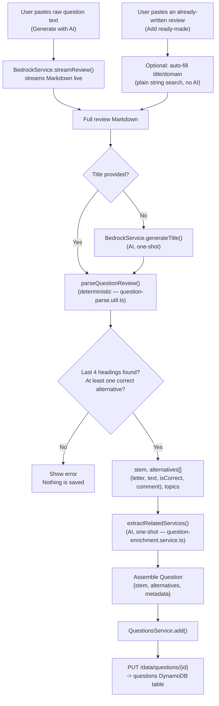

# Question ingestion pipeline

How a pasted exam question — either generated live by the app or pasted
already-reviewed from elsewhere (e.g. a Claude App conversation) — becomes a
structured `Question` (see [DynamoDB schema](./dynamodb-schema.md)). Both
entry points converge on the same deterministic parser and the same single
enrichment step; there is no separate "AI figures out the structure" path.

## Two entry points, one pipeline

`features/question-input/question-input.component.ts` offers two modes:

- **Generate with AI** (`onGenerate`) — the user pastes the raw, unstructured
  question text copied from a practice exam platform. The app streams a
  review out of Amazon Bedrock (`BedrockService.streamReview`, system prompt
  built in `core/utils/review-prompt.util.ts`) and shows it live as it
  arrives, token by token.
- **Add ready-made** (`onSaveManual`) — the user pastes a review that's
  already fully written, in the same Markdown template, generated elsewhere
  (typically pasted from a Claude App chat). Nothing is streamed; the whole
  text is available immediately. An optional "Auto-fill title & domain"
  button (`core/utils/ready-made-parse.util.ts`) is a plain string search for
  `### Título:` / `### Domínio da prova:` headings — no AI involved.

Once the full Markdown text is available (stream finished, or pasted
directly), **both paths run the exact same two steps**: deterministic
parsing, then one small AI enrichment call. Nothing about the review's
structure — the stem, the alternatives, which one is correct, or each
alternative's comment — is ever decided by asking an AI "what is this?". It
is always parsed, and the app refuses to save a question that doesn't parse.

## Step 1 — Deterministic parsing (no AI)

`core/utils/question-parse.util.ts` → `parseQuestionReview(review)`.

The review's Markdown always ends in four sections, in this fixed order,
whatever the exact heading wording turns out to be: **Question → Alternatives
→ Correct answer → Incorrect answers**. The parser exploits that fixed order
instead of matching specific heading text:

1. Find every `#`-heading line in the document.
2. Take the **last four** — those are Question / Alternatives / Correct /
   Incorrect, by position, regardless of language or exact wording. (A
   heading before those four, when present, is treated as the "key concepts"
   list and becomes `metadata.topics`.)
3. Alternatives are lines shaped like `*A. text*` — the letter and text are
   read directly, in original order.
4. The "Correct answer" section restates one or more of those same
   `*letter. text*` lines, each followed by prose — that prose becomes the
   comment for that letter, and marks it `isCorrect: true`.
5. The "Incorrect answers" section does the same for the rest — each
   restated letter's followed prose becomes that alternative's comment.

This position-based approach (not text-matching on exact headings) is
deliberate: it's what let the same parser handle both the current English
`####` template and an older Portuguese `###` template found in production
data without any special-casing — see the migration note in
[DynamoDB schema](./dynamodb-schema.md).

**If fewer than four headings are found, or no correct alternative is
identified, parsing returns `null`.** The caller shows an error and saves
nothing — there is no fallback that guesses at the structure.

## Step 2 — AI enrichment (one small, separate call)

Once parsing succeeds, `core/services/question-enrichment.service.ts` →
`extractRelatedServices(stem, alternatives)` makes one non-streaming Bedrock
call asking only for the vendor services/products the question references
(e.g. `["Amazon S3", "AWS Lambda"]`) — see
`core/utils/enrichment-prompt.util.ts`. This is metadata that genuinely can't
be extracted with a fixed rule, so it's the one place a model is asked to
interpret the content rather than the app parsing it directly.

A title is also generated by AI (`BedrockService.generateTitle`) — but only
when the user left the title field empty, as a convenience, not as part of
the structural extraction.

## Saving

The parsed `stem`/`alternatives`/`topics` plus the enriched
`relatedServices` are assembled into a `Question` and saved via
`QuestionsService.add()`, which persists it to `PUT /data/questions/{id}`
(the dedicated questions DynamoDB table).

## Flow diagram

## Related docs

- [DynamoDB schema](./dynamodb-schema.md) — the resulting `Question` shape
- [Frontend documentation](./frontend.md)
